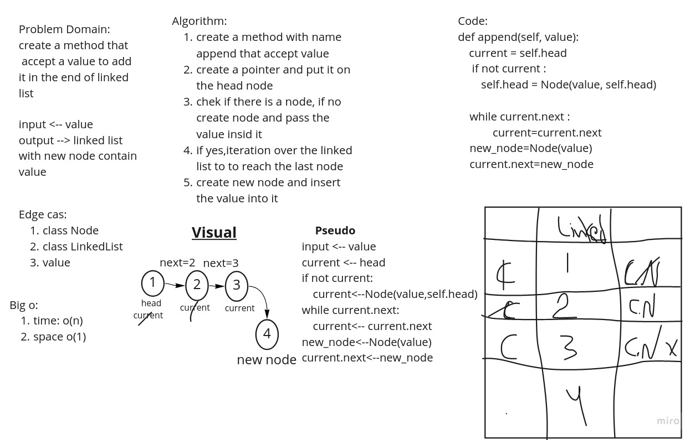
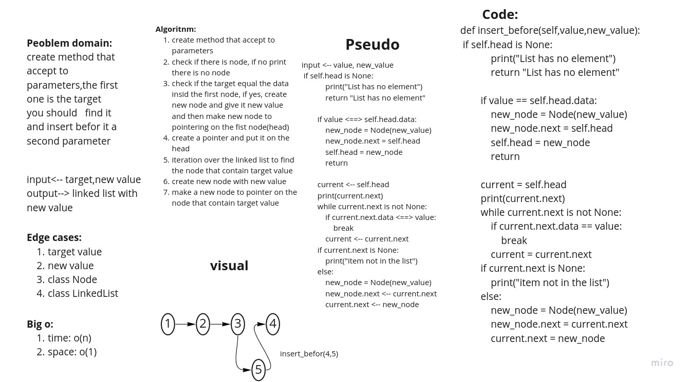
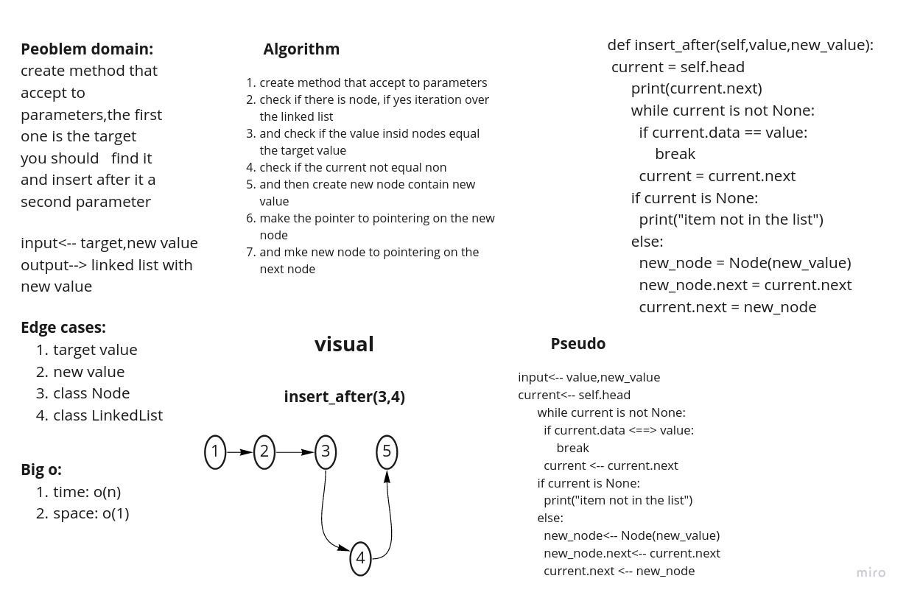

# Challenge Summary
<!-- Description of the challenge -->
1. create append method to add node in the end
2. add before method to add a node to the linked list before target value
3. add after method to add a node to the linked list after the target value
pull req: https://github.com/adhammhaydat/data-structures-and-algorithms/pull/26

## Whiteboard Process
<!-- Embedded whiteboard image -->
1.append():

2.insert_befor():

3.insert_after():

## Approach & Efficiency
<!-- What approach did you take? Why? What is the Big O space/time for this approach? -->
understanding how linked list work and how we can moving insid it by using pointer

big o for each method shown in whitebord

## Solution
<!-- Show how to run your code, and examples of it in action -->
create a
w
whitebord for each method and write the algorithm to descripe the input, proccess and output 
