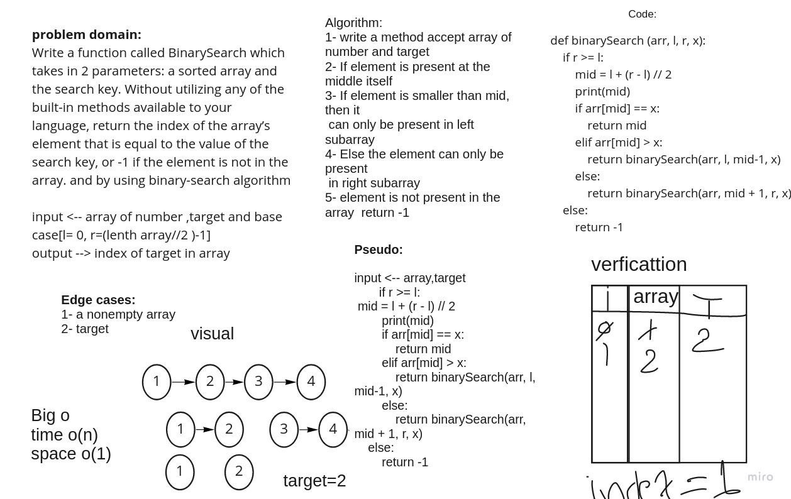

# Binary Search of Sorted Array
<!-- Description of the challenge -->

Write a function called BinarySearch which takes in 2 parameters: a sorted array and the search key. Without utilizing any of the built-in methods available to your language, return the index of the array’s element that is equal to the value of the search key, or -1 if the element is not in the array.

## Whiteboard Process

## Approach & Efficiency
<!-- What approach did you take? Discuss Why. What is the Big O space/time for this approach? -->

1. read carefully the problem domain and analyze it
2. determine the input and expected output
3. determine the algorithm that takes les time and space
4. write code
5. verfication the code

i used the BinarySearch algorithm because it dependance on seperate array more than one time; it check the liength of array and then stel divided it to find the target number,

the big o for this algorthim is o(n) because it not have to iteration over the array
