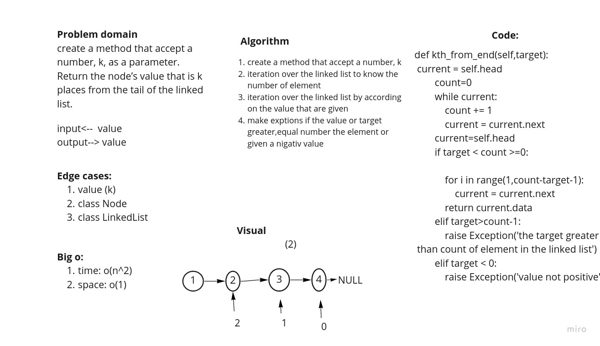

# Challenge Summary
<!-- Description of the challenge -->
Write the following method for the Linked List class:

kth from end
argument: a number, k, as a parameter.
Return the node’s value that is k places from the tail of the linked list.
You have access to the Node class and all the properties on the Linked List class as well as the methods created in previous challenges.

## Whiteboard Process
<!-- Embedded whiteboard image -->

## Approach & Efficiency
<!-- What approach did you take? Why? What is the Big O space/time for this approach? -->
create a method that accept a number, k
iteration over the linked list to know the number of element
iteration over the linked list by according on the value that are given
make exptions if the value or target greater,equal number the element or given a nigativ value

the big o shown in whitebord
## Solution
<!-- Show how to run your code, and examples of it in action -->
following the unit test to check if everything working fine
