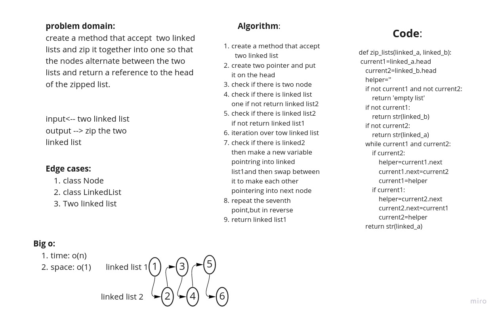

# Challenge Summary
<!-- Description of the challenge -->
Write a function called zip lists
Arguments: 2 linked lists
Return: Linked List, zipped as noted below
Zip the two linked lists together into one so that the nodes alternate between the two lists and return a reference to the head of the zipped list.
Try and keep additional space down to O(1)
You have access to the Node class and all the properties on the Linked List class as well as the methods created in previous challenges.

## Whiteboard Process
<!-- Embedded whiteboard image -->

## Approach & Efficiency
<!-- What approach did you take? Why? What is the Big O space/time for this approach? -->
create a method that accept   two linked list
create two pointer and put it on the head
check if there is two node
check if there is linked list one if not return linked list2
check if there is linked list2 if not return linked list1
iteration over tow linked list
check if there is linked2 then make a new variable pointring into linked list1and then swap between it to make each other pointering into next node
repeat the seventh point,but in reverse
return linked list1

## Solution
<!-- Show how to run your code, and examples of it in action -->
follow unit test to check if
everything worke fine
