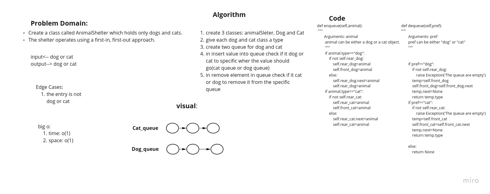

# Challenge Summary
<!-- Description of the challenge -->
Create a class called AnimalShelter which holds only dogs and cats.
The shelter operates using a first-in, first-out approach.

pull: https://github.com/adhammhaydat/data-structures-and-algorithms/pull/33

## Whiteboard Process
<!-- Embedded whiteboard image -->

## Approach & Efficiency
<!-- What approach did you take? Why? What is the Big O space/time for this approach? -->
1. create 3 classes: animalSleter, Dog and Cat
give each dog and cat class a type
2. create two queue for dog and cat
3. in insert value into queue check if it dog or cat to specific wher the value should go(cat queue or dog queue)
4. in remove element in queue check if it cat or dog to remove it from the specific queue

