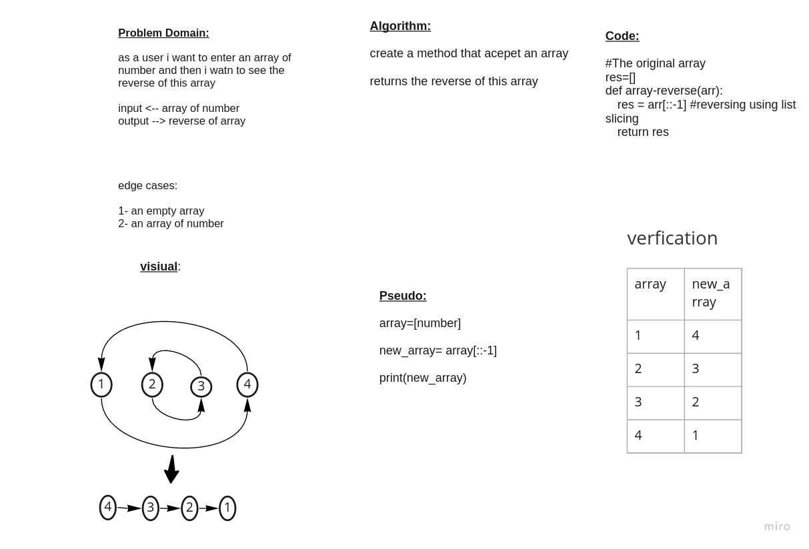

# array-reverse

## Whiteboard Process

## Approach & Efficiency
<!-- What approach did you take? Discuss Why. What is the Big O space/time for this approach? -->

1. read carefully the problem domain and analyze it
2. determine the input and expected output
3. determine the algorithm that takes les time and space
4. write code
5. verfication the code

the big o are:
time 0(1): thir no looping
space o(1): assign one array

