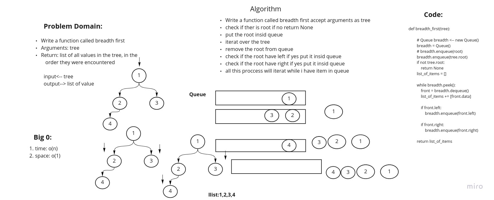

# Challenge Summary
<!-- Description of the challenge -->
Write a function called breadth first
Arguments: tree
Return: list of all values in the tree, in the order they were encountered

pull req: https://github.com/adhammhaydat/data-structures-and-algorithms/pull/38

## Whiteboard Process
<!-- Embedded whiteboard image -->

## Approach & Efficiency
<!-- What approach did you take? Why? What is the Big O space/time for this approach? -->
Make a whiteboard in the first and detrmin the algorithm that gives me the best big o
## Solution
<!-- Show how to run your code, and examples of it in action -->

Write a function called breadth first accept arguments as tree
check if ther is root if no return None
put the root insid queue
iterat over the tree
remove the root from queue
check if the root have left if yes put it insid queue
check if the root have right if yes put it insid queue
all this proccess will iterat while i have item in queue
