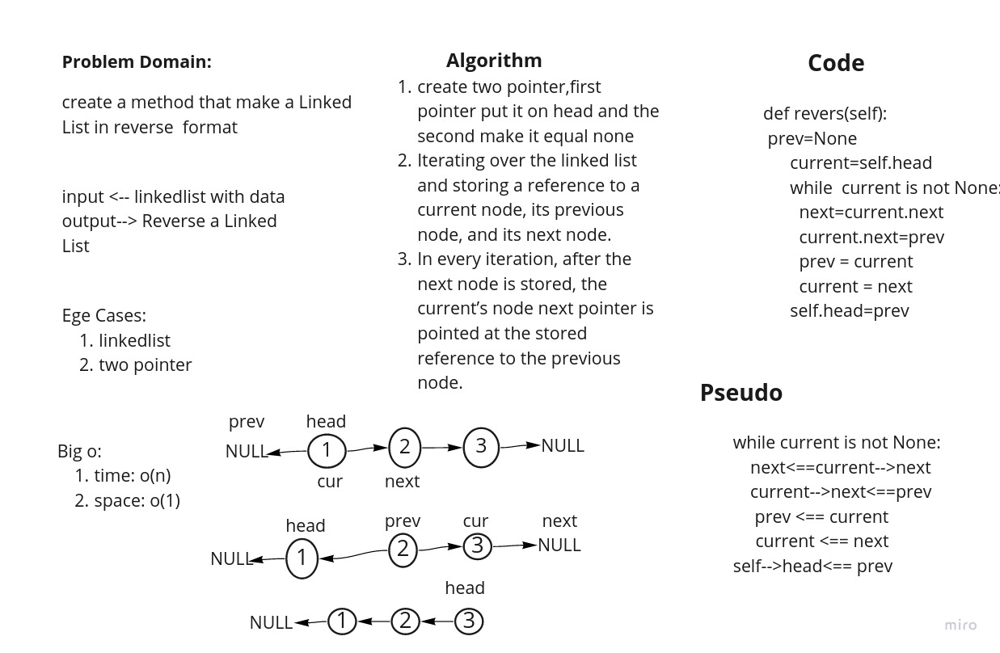

# Challenge Summary
<!-- Description of the challenge -->
create a method that make a LinkedList in reverse  format
pull req:https://github.com/adhammhaydat/data-structures-and-algorithms/pull/29
## Whiteboard Process
<!-- Embedded whiteboard image -->

## Approach & Efficiency
<!-- What approach did you take? Why? What is the Big O space/time for this approach? -->
create two pointer,first pointer put it on head and the second make it equal none
Iterating over the linked list and storing a reference to a current node, its previous node, and its next node.
In every iteration, after the next node is stored, the current’s node next pointer is pointed at the stored reference to the previous node.

## Solution
<!-- Show how to run your code, and examples of it in action -->
follow unit test to check if
everything worke fine
