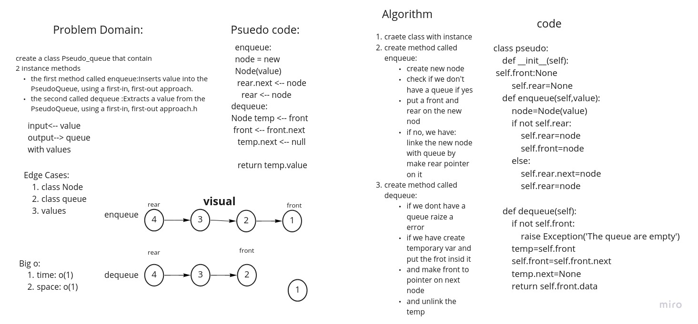

# Challenge Summary
<!-- Description of the challenge -->
Create a new class called pseudo queue contain 2 method:
1. enqueue: Inserts value into the PseudoQueue, using a first-in, first-out approach.
2. dequeue: Extracts a value from the PseudoQueue, using a first-in, first-out approach.h

make some unit test to check if your soluation is perfect
pull req: https://github.com/adhammhaydat/data-structures-and-algorithms/pull/32
## Whiteboard Process
<!-- Embedded whiteboard image -->

## Approach & Efficiency
<!-- What approach did you take? Why? What is the Big O space/time for this approach? -->
determain the algorithm that i will use to solve the challenge

determain the best big o
## Solution
<!-- Show how to run your code, and examples of it in action -->
craete class with instance
create method called enqueue:
create new node
check if we don't have a queue if yes
put a front and rear on the new nod
if no, we have: linke the new node with queue by make rear pointer on it
create method called dequeue:
if we dont have a queue raize a error
if we have create temporary var and put the frot insid it
and make front to pointer on next node
and unlink the temp
