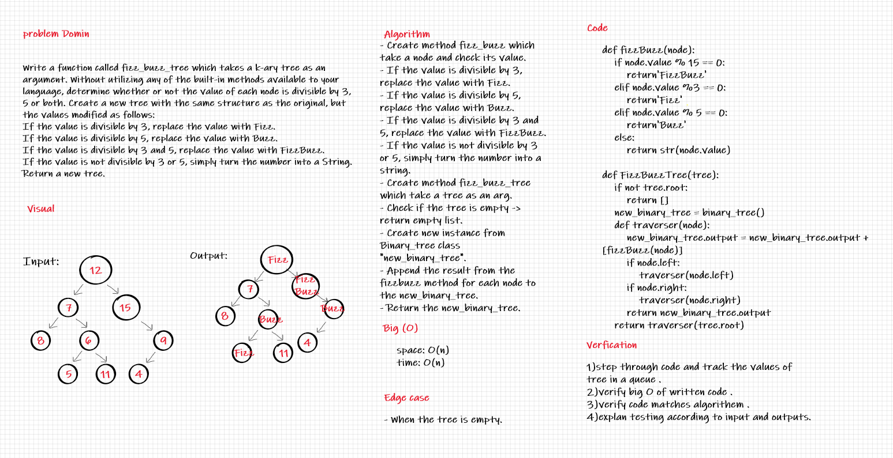

# Challenge Summary
<!-- Description of the challenge -->
Write a function called fizz buzz tree
Arguments: k-ary tree
Return: new k-ary tree
pull: https://github.com/adhammhaydat/data-structures-and-algorithms/pull/39
## Whiteboard Process
<!-- Embedded whiteboard image -->

## Approach & Efficiency
<!-- What approach did you take? Why? What is the Big O space/time for this approach? -->
Determine whether or not the value of each node is divisible by 3, 5 or both. Create a new tree with the same structure as the original, but the values modified as follows:
## Solution
<!-- Show how to run your code, and examples of it in action -->
follow unit test to check if
everything worke fine
