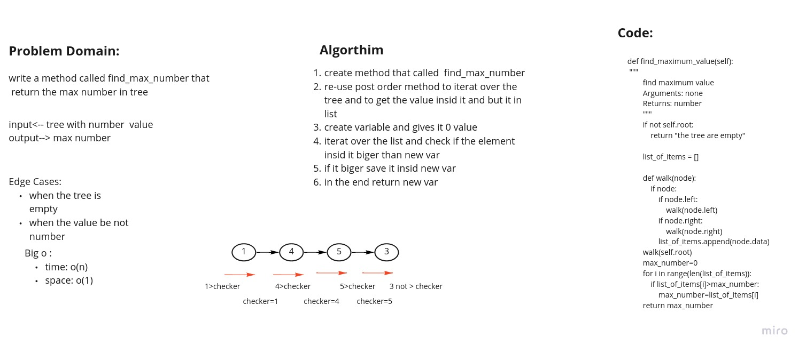

# Challenge Summary
<!-- Description of the challenge -->
create a method to find the max number insid the tree

## Whiteboard Process
<!-- Embedded whiteboard image -->

## Approach & Efficiency
<!-- What approach did you take? Why? What is the Big O space/time for this approach? -->
the approach is by re-use post order method

big o as shown in whiteboard

## Solution
<!-- Show how to run your code, and examples of it in action -->
create method that called  find_max_number
re-use post order method to iterat over the tree and to get the value insid it and but it in list
create variable and gives it 0 value
iterat over the list and check if the element insid it biger than new var
if it biger save it insid new var
in the end return new var
