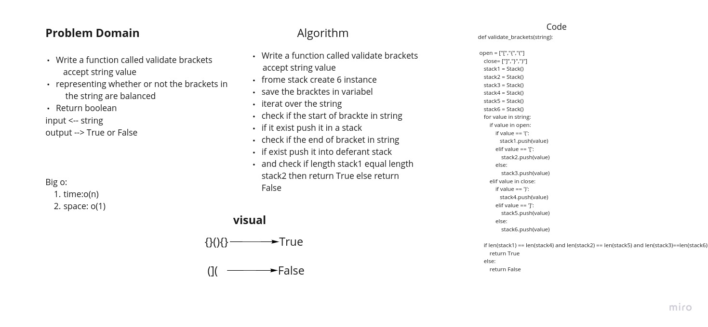

# Challenge Summary
<!-- Description of the challenge -->
Write a function called validate brackets accept string value
representing whether or not the brackets in
the string are balanced
Return boolean
### pull :https://github.com/adhammhaydat/data-structures-and-algorithms/pull/34
## Whiteboard Process
<!-- Embedded whiteboard image -->

## Approach & Efficiency
<!-- What approach did you take? Why? What is the Big O space/time for this approach? -->

The big o is:
time : O(n)
space: o(1)

## Solution
<!-- Show how to run your code, and examples of it in action -->
- Write a function called validate brackets
   accept string value
- frome stack create 6 instance
- save the bracktes in variabel
- iterat over the string
- check if the start of brackte in string
- if it exist push it in a stack
- check if the end of bracket in string
- if exist push it into deferant stack
- and check if length stack1 equal length stack2 then return True else return False
